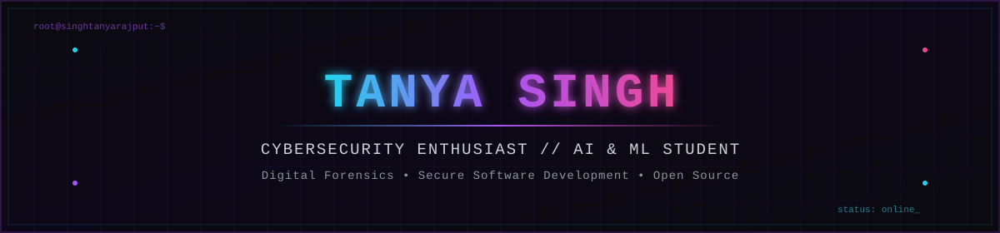

<div align="center">



<br/>

[](https://git.io/typing-svg)

<br/>


</div>

<br/>

##  About Me

```yaml
## 👋 About Me

Hi, I'm **Tanya Singh**, a third-year B.Tech student in Artificial Intelligence & Machine Learning at Vivekananda Institute of Professional Studies (VIPS-TC), GGSIPU.

I'm passionate about cybersecurity, AI, digital forensics, and secure software development. I enjoy building practical security tools, contributing to open source, and exploring how AI can strengthen modern cyber defense.
```

I'm an AI/ML student with a growing focus on cybersecurity, digital forensics, and security research. I enjoy building practical security tools, breaking down how systems fail, and learning by doing — whether that's writing a vulnerability scanner, analyzing crime data, or contributing to open source.

**Interested in:**

`Cybersecurity` · `Ethical Hacking` · `Web Security` · `Digital Forensics` · `Artificial Intelligence` · `Machine Learning` · `Secure Software Development` · `Open Source`

<br/>

##  Currently Learning

<div align="center">

| 🎯 Threat Detection | 🔍 Vulnerability Assessment | 📜 OWASP Top 10 |
|:---:|:---:|:---:|
| 🔐 Secure Coding | 🚨 Incident Response | 🦠 Malware Analysis |
| 🤖 AI for Cybersecurity | 🕵️ Digital Forensics | |

</div>

<br/>

##  Tech Stack

**Programming**


**Frameworks**


**Libraries**


**Tools**


**Cybersecurity**


<br/>

##  Major Personal Projects

> Only repositories that currently exist on my profile are linked below. Projects still in development are listed without a link.

<table>
<tr>
<td width="50%" valign="top">

**🛡️ Vulnerability Scanner**

Automated scanner that identifies common vulnerabilities (open ports, outdated services, weak configurations) across a target.

`Tech:` Python, Nmap, Sockets
`Security relevance:` Practical exposure to reconnaissance and vulnerability assessment workflows used in real security audits.

</td>
<td width="50%" valign="top">

**🔑 Password Strength Analyzer**

Tool that evaluates password strength using entropy, pattern detection, and breach-list checks, with actionable feedback.

`Tech:` Python
`Security relevance:` Reinforces secure authentication practices and demonstrates understanding of common password attack vectors.

</td>
</tr>
<tr>
<td width="50%" valign="top">

**🎣 Phishing Email Detector**

ML-based classifier that flags phishing attempts by analyzing email content, headers, and URL patterns.

`Tech:` Python, Scikit-learn, NLP
`Security relevance:` Applies AI to a top real-world attack vector — social engineering via email — for early threat detection.

</td>
<td width="50%" valign="top">

**📊 Crime Data Analysis**

Data analysis project uncovering patterns and trends in crime datasets to support evidence-based insights.

`Tech:` Python, Pandas, Data Visualization
`Security relevance:` Builds analytical skills directly transferable to threat intelligence and digital forensics workflows.

</td>
</tr>
<tr>
<td width="50%" valign="top" colspan="2">

**🕶️ ZeroTrace** *(in development — not yet linked)*

A privacy-focused tool concept centered on minimizing digital footprint and protecting user data.

`Tech:` Python
`Security relevance:` Explores privacy engineering principles and data minimization — core concepts in modern application security.

</td>
</tr>
</table>

<br/>

##  Research

**Geoengineering and Climate Change**

Presented research on **Geoengineering and Climate Change**, exploring engineering interventions for climate mitigation and evaluating their technical feasibility, risks, and long-term implications.

<br/>

##  Open Source & Community

- 🌐 Learning security concepts through open-source projects and documentation (including OWASP resources)
- 🤝 Engaging with the broader security community to build practical, real-world knowledge
- 🔒 Practicing secure software development principles in personal projects
- 📖 Actively working toward deeper open-source contribution over time

<br/>

##  Achievements

- 🎓 Presented independent research on Geoengineering and Climate Change
- 🛠️ Built multiple hands-on cybersecurity and AI/ML projects
- 🏆 Participated in hackathons
- 🌱 Ongoing open-source learning and contribution

<br/>

##  GitHub Analytics

<div align="center">


</div>

### Contribution Snake

<div align="center">

<picture>
  <source media="(prefers-color-scheme: dark)" srcset="https://raw.githubusercontent.com/singhtanyarajput/singhtanyarajput/output/github-contribution-grid-snake-dark.svg"/>
  <source media="(prefers-color-scheme: light)" srcset="https://raw.githubusercontent.com/singhtanyarajput/singhtanyarajput/output/github-contribution-grid-snake.svg"/>
  
</picture>


</div>

<br/>

##  Contact

<div align="center">

[](https://github.com/singhtanyarajput)
[](https://www.linkedin.com/tanyasingh2006/)
[](mailto:singhtanyaofficial@gmail.com)


</div>

<br/>

---

<div align="center">

*"Security is not a product, but a process."*

**— Bruce Schneier**

</div>
